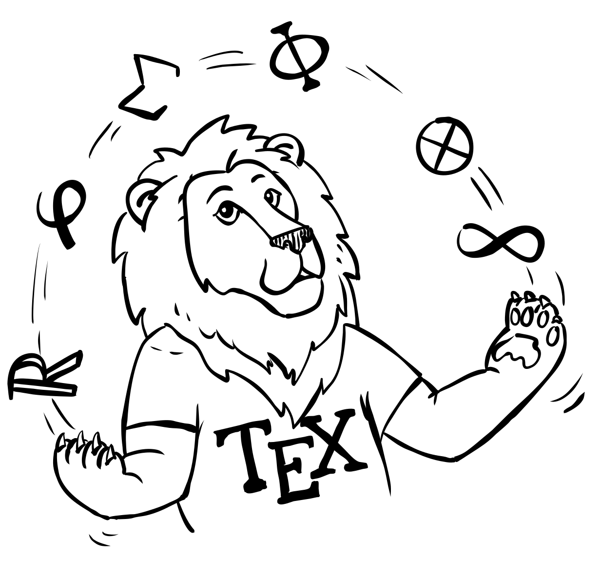

# The Not So Short Introduction to LaTeX

<!-- URLs can be found at the bottom -->

[![CTAN English][ctan-english-shield]][ctan-english-url]
[![CTAN All languages][ctan-shield]][ctan-url]
[![Contributors][contributors-shield]][contributors-url]
[![Forks][forks-shield]][forks-url] [![Stars][stars-shield]][stars-url]
[![Issues][issues-shield]][issues-url]
[![GPLv3 License][license-shield]][license-url] [![CI][ci-shield]][ci-url]

  

If you want to learn how to write your documents with LaTeX, this introduction
is for you. It contains the basic information about setting up a LaTeX system
and using it to write documents. The current stable version of the package may
be found on [CTAN][ctan-english-url]. Many translations exist (though not
necessarily up to date) and can be found [here][ctan-url].

## Building from source

The newest version of the document is available on [GitHub][github]. To build
the document yourself you will need resonably recent versions (mine are listed
in the parentheses) of the following programs:

- `TeXLive` (`2022`, `full`)
- `git` (`2.36.1`)
- `GNU make` (`4.3`)
- `pygments` (`2.12.0`)
- `perl` (`v5.36.0`)

After installing them there are just three steps:

1. Clone the repository with submodules.

   `git clone https://github.com/oetiker/lshort.git --recurse-submodules`

2. Change to the cloned directory.

   `cd lshort`

3. Compile.

   `make`

Note that compiling for the first time takes a _really_ long time. This is
because `pygments` and example cache need to build. Subsequent runs should be
significantly faster.

The current development builds are also available on [Actions][ci-url] page.

## Copyright

The book is released under the GPLv3 (or later) license. Full text can be found
[here](LICENSE). Copyright © 1995-2022 Tobias Oetiker, Marcin Serwin, Hubert
Partl, Irene Hyna, Elisabeth Schlegl and Contributors.

The title page [illustration](src/images/title-illustration.svg) by [Roman
Schmid][bummzack] is dedicated to the public domain via [CC0 1.0 Universal
Public Domain Dedication][cc0-url].

<!-- URLs -->

[contributors-shield]:
  https://img.shields.io/github/contributors/oetiker/lshort.svg?style=for-the-badge
[contributors-url]: https://github.com/oetiker/lshort/graphs/contributors
[forks-shield]:
  https://img.shields.io/github/forks/oetiker/lshort.svg?style=for-the-badge
[forks-url]: https://github.com/oetiker/lshort/network/members
[stars-shield]:
  https://img.shields.io/github/stars/oetiker/lshort.svg?style=for-the-badge
[stars-url]: https://github.com/oetiker/lshort/stargazers
[issues-shield]:
  https://img.shields.io/github/issues/oetiker/lshort.svg?style=for-the-badge
[issues-url]: https://github.com/oetiker/lshort/issues
[license-shield]:
  https://img.shields.io/github/license/oetiker/lshort.svg?style=for-the-badge
[license-url]: https://github.com/oetiker/lshort/blob/master/LICENSE
[ci-shield]:
  https://img.shields.io/github/workflow/status/oetiker/lshort/CI?style=for-the-badge
[ci-url]: https://github.com/oetiker/lshort/actions/workflows/CI.yml
[ctan-english-url]: https://ctan.org/pkg/lshort-english
[ctan-english-shield]:
  https://img.shields.io/badge/CTAN-English-informational?style=for-the-badge
[ctan-url]: https://ctan.org/pkg/lshort
[ctan-shield]:
  https://img.shields.io/badge/CTAN-All-informational?style=for-the-badge
[github]: https://github.com/oetiker/lshort
[cc0-url]: https://creativecommons.org/publicdomain/zero/1.0/
[bummzack]: https://github.com/bummzack
